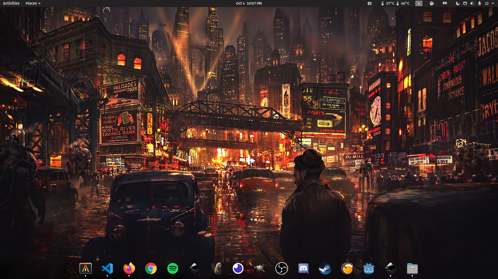

For a lots of months, i struggled finding a linux distribution that was stable enough and appeal to me. After trying Ubuntu, Linux Mint, KDE Neon and Manjaro, i decided to install Pop!\_OS, a distribution based in Ubuntu but featuring a custom GNOME desktop.
At the beginning i though that it will be just Ubuntu with a few modifications, but at the end it has been more than that and you can see that just when you download it, because you can choose between two different iso files, one with AMD driver and another one with NVIDIA driver installed.

The installation process is very smooth like the great majority of linux distributions. The default desktop enviroment as i mentioned before comes with GNOME but with a few differences in icons, theme, color shcemes and extensions.
Pop!\_OS has Flatpak installed and Flathub configured by default and the Pop!\_Shop can be used to install fratpaks aswell which is something that i really like.
Another thing that i like is the auto-tiling extension

